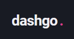
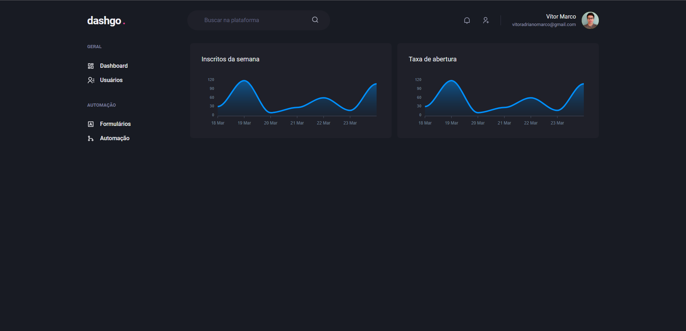
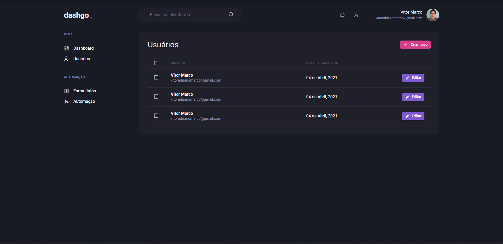

<!-- logo
<p align="center">
  
</p> -->

<p align="center">
 <a href="#dashgo">Sobre</a> •
 <a href="#-layout">Layout</a>  •
 <a href="#-como-executar-o-projeto">Como executar o projeto</a>  •
 <a href="#-tecnologias">Tecnologias</a>
</p>

# Dashgo

<p align="center">
  
</p>

Projeto abordado no módulo 4 do Ignite. <br> Objetivo é apresentar alguns conceitos como **Interfaces Declarativas**, utilizando o **Chakra** como ferramenta.
Utilização de controles de formulários, com o **React Hook Form** <br>

<h4 align="center"> 🚧 Dashgo 🚀 Em construção 🚧 </h4>
<!-- <h4 align="center"> 🚧 Dashgo ✅ Concluído 🚧 </h4> -->

## 🎨 Layout

<p align="center" style="display: flex; align-items: flex-start; justify-content: center; gap: 8px ">
  
  
  
</p>

<!--
<a href="https://www.figma.com/file/D0dCXNNcvdhMVgn8ZczRPQ/Desafios-M%C3%B3dulo-3-ReactJS?node-id=0%3A1">
  
</a> -->

## 🚀 Como executar o projeto

### Pré-requisitos

Antes de começar, você vai precisar ter instalado em sua máquina as seguintes ferramentas:

- [Git](https://git-scm.com) e [Node.js](https://nodejs.org/en/);
- Além disto é bom ter um editor para trabalhar com o código, como o [VSCode](https://code.visualstudio.com/).

Após tudo configurado e instalado

> Clone este repositório

```bash
 git clone https://github.com/vitormarco/dashgo.git
```

> Acesse a pasta pelo terminal/cmd

```bash
 cd dashgo
```

> Execute comando para instalar as dependências

```bash
 yarn
 # ou
 npm install
```

> execute o script para inicial o projeto

```bash
 yarn dev
 # ou
 npm run dev
```

## 🛠 Tecnologias

As seguintes ferramentas foram usadas na construção do projeto:

- ✔️ [ReactJS](https://reactjs.org/)
- ✔️ [Typescript](https://www.typescriptlang.org/)
- ✔️ [Next](https://nextjs.org/docs/basic-features/typescript)
- ✔️ [Chakra](https://chakra-ui.com/)
- ✔️ [React Query](https://tanstack.com/query/v4/docs/overview)

> Veja o arquivo [package.json](https://github.com/vitormarco/dashgo/blob/master/package.json)

Feito com 🧡 por Vítor Marco 👋🏽 [Entre em contato!](https://www.linkedin.com/in/vitor-marco/)
